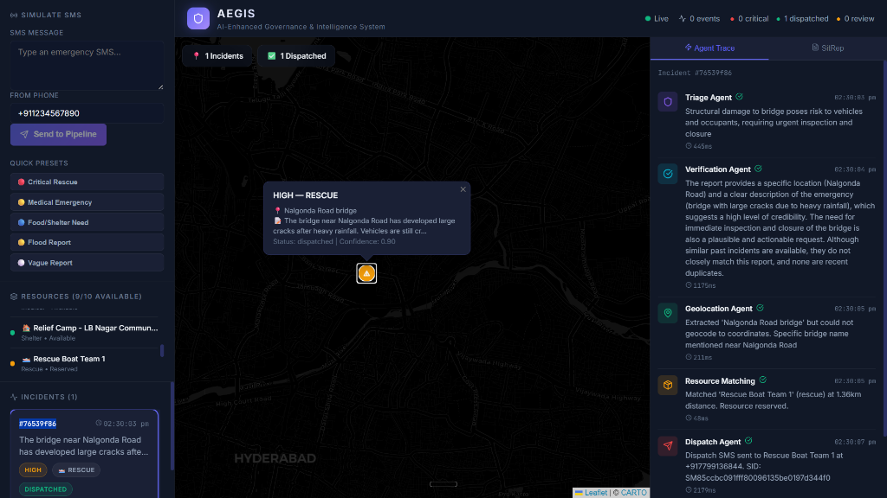
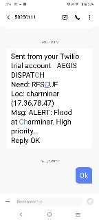

# AEGIS — Autonomous Emergency & Ground Incident System

> AI-powered disaster response coordination platform that transforms citizen SMS reports into actionable emergency dispatches in seconds.

### 🔗 Live Deployment Links
* **Live Dashboard (Vercel)**: [aegis-hackathon-seven.vercel.app](https://aegis-hackathon-seven.vercel.app/)
* **Live API Explorer (Render)**: [aegis-hackathon-86b2.onrender.com/docs](https://aegis-hackathon-86b2.onrender.com/docs)

---

## Table of Contents

- [Project Overview](#project-overview)
- [Problem Statement](#problem-statement)
- [Features](#features)
- [System Architecture](#system-architecture)
- [AI Agent Architecture](#ai-agent-architecture)
- [Technology Stack](#technology-stack)
- [Data Handling](#data-handling)
- [Database Design](#database-design)
- [System Workflow](#system-workflow)
- [API Documentation](#api-documentation)
- [Installation](#installation)
- [Environment Variables](#environment-variables)
- [Folder Structure](#folder-structure)
- [Future Enhancements](#future-enhancements)
- [Challenges Faced](#challenges-faced)
- [Screenshots](#screenshots)

---

## Project Overview

### What Problem Does AEGIS Solve?

During natural disasters — floods, earthquakes, cyclones — emergency teams are overwhelmed by thousands of unstructured citizen reports arriving via SMS, phone calls, and social media. Human operators cannot process, verify, prioritize, and dispatch resources fast enough. Lives are lost not because resources are unavailable, but because coordination fails under pressure.

### Who Are the Users?

| User               | Role                                                      |
| ------------------- | --------------------------------------------------------- |
| **Citizens**        | Report emergencies via SMS to a Twilio phone number       |
| **EOC Operators**   | Monitor the real-time dashboard and oversee agent actions  |
| **Field Volunteers**| Receive dispatch SMS with incident details and location    |
| **Decision Makers** | Read AI-generated Situation Reports for strategic response |

### How Does AEGIS Help?

AEGIS replaces the manual coordination bottleneck with a **multi-agent AI pipeline** that processes each SMS report through six specialized agents — classifying severity, verifying authenticity, extracting location, matching the nearest resource, dispatching via SMS, and generating a live situation report — all within **2–3 seconds**, with full transparency via a real-time dashboard.

---

## Problem Statement

### The Coordination Gap in Disaster Response

Emergency management systems face a critical bottleneck: the gap between **incident reporting** and **resource dispatch**. Existing solutions fall short in several areas:

| Challenge                     | Current Reality                                           |
| ----------------------------- | --------------------------------------------------------- |
| **Volume Overload**           | Thousands of SMS/calls arrive simultaneously              |
| **Unstructured Data**         | Citizens report in local language, slang, abbreviations   |
| **No Verification**           | Duplicate and false reports waste limited resources        |
| **Manual Triage**             | Human operators create 30–60 minute processing delays     |
| **No Location Intelligence**  | Citizens describe locations by landmarks, not coordinates |
| **Resource Blindness**        | Dispatchers lack real-time visibility into resource availability |

### Why Existing Solutions Are Insufficient

- **112/NDRF Hotlines**: Rely entirely on human operators who fatigue under sustained load.
- **Social Media Monitoring**: No structured pipeline — tweets and posts are scattered, unverified, and not actionable.
- **GIS Platforms**: Provide mapping but no automated triage, verification, or dispatch.
- **No AI Integration**: Current systems do not use LLMs for natural language understanding, confidence scoring, or report summarization.

### Real-World Impact

AEGIS demonstrates that AI agents can **reduce incident-to-dispatch time from 30+ minutes to under 5 seconds** while maintaining verification safeguards that prevent resource waste on unconfirmed reports.

---

## Features

### Implemented (MVP)

| Feature                       | Description                                                                  |
| ----------------------------- | ---------------------------------------------------------------------------- |
| 📱 **SMS Incident Reporting**  | Citizens send emergency SMS to a Twilio number; pipeline processes automatically |
| 🔴 **AI-based Incident Triage**| Classifies severity (critical/high/medium) and need type (medical/rescue/food/shelter) |
| ✅ **Confidence Verification** | RAG-backed scoring using historical incident patterns + heuristic flags       |
| 📍 **Geolocation**             | Extracts landmark names via LLM, resolves to coordinates via gazetteer/Google Maps |
| 📦 **Resource Matching**       | Finds nearest available resource by type + haversine distance (no LLM)       |
| 📤 **Dispatch Agent**          | Sends formatted dispatch SMS to assigned volunteer via Twilio                |
| 📊 **Situation Report**        | AI-generated markdown summary of all active incidents for EOC staff          |
| 🗺️ **Live Dashboard**          | Three-panel React dashboard with map, incident feed, and agent trace         |
| 🔄 **Real-time Updates**       | WebSocket push after every pipeline step — judges watch it happen live       |
| 📋 **Agent Activity Logs**     | Full step-by-step trace of every agent decision with timing                  |
| 🎯 **Decision Gate**           | Low-confidence incidents flagged for human review instead of auto-dispatch   |
| 🔁 **Simulate Endpoint**       | Demo entry point — identical pipeline without requiring Twilio               |

---

## System Architecture

### High-Level Overview

AEGIS follows a **three-tier architecture**: SMS ingestion layer, multi-agent processing pipeline, and real-time dashboard.

```
┌─────────────────────────────────────────────────────────────────────────────┐
│                              INGESTION LAYER                                │
│  ┌──────────────┐   ┌──────────────────┐   ┌──────────────────────────┐    │
│  │ Twilio SMS   │   │  Simulate API    │   │  (Future: Twitter/Voice) │    │
│  │ Webhook      │   │  POST /simulate  │   │                          │    │
│  └──────┬───────┘   └────────┬─────────┘   └──────────────────────────┘    │
│         └────────────────────┼─────────────────────────────────────────     │
└──────────────────────────────┼─────────────────────────────────────────────┘
                               ▼
┌─────────────────────────────────────────────────────────────────────────────┐
│                         ORCHESTRATOR PIPELINE                               │
│                                                                             │
│  ┌──────────┐  ┌──────────────┐  ┌─────────────┐  ┌──────────────────┐    │
│  │ Triage   │→ │ Verification │→ │ Geolocation │→ │ Resource Match   │    │
│  │ Agent    │  │ Agent        │  │ Agent       │  │ Agent            │    │
│  │(Groq 8B) │  │(Groq 70B)   │  │(Groq 8B)   │  │(SQL+Haversine)   │    │
│  └──────────┘  └──────────────┘  └─────────────┘  └──────────────────┘    │
│                       │                                     │              │
│                  Decision Gate                              ▼              │
│                  (confidence<0.6                   ┌──────────────────┐    │
│                   → needs_review)                  │ Dispatch Agent   │    │
│                                                    │ (Twilio SMS)     │    │
│                                                    └────────┬─────────┘    │
│                                                             ▼              │
│                                                    ┌──────────────────┐    │
│                                                    │ SitRep Agent     │    │
│                                                    │ (Groq 70B)       │    │
│                                                    └──────────────────┘    │
└──────────────────────────────────────────────────────────────┬──────────────┘
                                                               │
                            WebSocket Broadcast                │
                               ▼                               ▼
┌─────────────────────────────────────────────────────────────────────────────┐
│                         PRESENTATION LAYER                                  │
│                                                                             │
│  ┌──────────────┐   ┌────────────────┐   ┌──────────────────────────┐      │
│  │ Incident Map │   │ Agent Trace    │   │ Situation Report Panel   │      │
│  │ (Leaflet.js) │   │ (Step-by-step) │   │ (AI-generated summary)  │      │
│  └──────────────┘   └────────────────┘   └──────────────────────────┘      │
│                                                                             │
│  ┌──────────────┐   ┌────────────────┐   ┌──────────────────────────┐      │
│  │ SMS Simulate │   │ Resource Panel │   │ Incident Feed            │      │
│  │ Form         │   │ (Availability) │   │ (Real-time list)         │      │
│  └──────────────┘   └────────────────┘   └──────────────────────────┘      │
└─────────────────────────────────────────────────────────────────────────────┘
```

### Component Connections

| Component         | Communicates With              | Protocol    |
| ----------------- | ------------------------------ | ----------- |
| Twilio            | Backend (webhook)              | HTTPS POST  |
| Backend           | Groq API                       | HTTPS REST  |
| Backend           | ChromaDB                       | In-process  |
| Backend           | Google Maps API                | HTTPS REST  |
| Backend           | SQLite                         | File I/O    |
| Backend           | Dashboard                      | WebSocket   |
| Dashboard         | Backend REST API               | HTTP GET    |

---

## AI Agent Architecture

### Orchestrator

The Orchestrator is the central controller — a single async function that sequences all agents, logs every step, applies decision logic, and broadcasts live updates via WebSocket.

- **Purpose**: Coordinate the sequential execution of all 6 agents
- **Input**: Raw SMS text + sender phone number
- **Output**: Fully processed incident with dispatch and SitRep
- **Connected Components**: All agents, database, WebSocket manager

### Agent 1: Triage Agent

| Property     | Details                                                          |
| ------------ | ---------------------------------------------------------------- |
| **Purpose**  | Classify incident severity and need type from raw SMS text       |
| **LLM**      | `llama-3.1-8b-instant` via Groq (fast inference)                |
| **Input**    | Raw SMS text                                                     |
| **Output**   | `severity` (critical/high/medium), `need_type` (medical/rescue/food/shelter) |
| **Method**   | 6 few-shot examples + structured JSON response                   |
| **Connected**| Orchestrator → Database (updates incident)                       |

### Agent 2: Verification Agent

| Property     | Details                                                          |
| ------------ | ---------------------------------------------------------------- |
| **Purpose**  | Score confidence that the incident is genuine and actionable     |
| **LLM**      | `llama-3.3-70b-versatile` via Groq (strong reasoning)           |
| **Input**    | Raw SMS text, triage severity, triage need type                  |
| **Output**   | `confidence_score` (0.0–1.0), `flags` (list of concerns)        |
| **Method**   | RAG retrieval from ChromaDB (similar past incidents) + LLM analysis + heuristic rules |
| **Connected**| ChromaDB (vector search), Orchestrator → Decision Gate           |

### Agent 3: Geolocation Agent

| Property     | Details                                                          |
| ------------ | ---------------------------------------------------------------- |
| **Purpose**  | Extract location/landmark name from SMS and resolve to coordinates |
| **LLM**      | `llama-3.1-8b-instant` via Groq (fast extraction)               |
| **Input**    | Raw SMS text                                                     |
| **Output**   | `landmark_name`, `latitude`, `longitude`, `source`               |
| **Method**   | LLM extracts landmark → Hybrid geocoding (gazetteer primary, Google Maps fallback) |
| **Connected**| Geocoding Service, Orchestrator → Database                       |

### Agent 4: Resource Matching Agent

| Property     | Details                                                          |
| ------------ | ---------------------------------------------------------------- |
| **Purpose**  | Find the nearest available resource matching the incident need   |
| **LLM**      | None — pure SQL query + haversine distance calculation           |
| **Input**    | Incident coordinates (`lat`, `lng`), `need_type`                 |
| **Output**   | `resource_id`, `resource_name`, `distance_km`, `contact_phone`   |
| **Method**   | Query available resources by type → calculate distances → select nearest → reserve atomically |
| **Connected**| SQLite database, Orchestrator                                    |

### Agent 5: Dispatch Agent

| Property     | Details                                                          |
| ------------ | ---------------------------------------------------------------- |
| **Purpose**  | Send a formatted dispatch SMS to the assigned volunteer/resource |
| **LLM**      | None — template-based message composition                        |
| **Input**    | Incident details, resource contact phone, location               |
| **Output**   | `sms_sid`, `dispatch_message`, `contact_phone`                   |
| **Method**   | Compose dispatch message → Send via Twilio API (or log-only fallback) |
| **Connected**| Twilio Service, Orchestrator → Database (dispatch record)        |

### Agent 6: SitRep Agent

| Property     | Details                                                          |
| ------------ | ---------------------------------------------------------------- |
| **Purpose**  | Generate a live Situation Report summarizing all active incidents |
| **LLM**      | `llama-3.3-70b-versatile` via Groq (strong summarization)       |
| **Input**    | All active incidents from database                               |
| **Output**   | Markdown summary with counts, critical items, and recommendations |
| **Method**   | Query all non-resolved incidents → Format for LLM → Generate structured summary |
| **Connected**| SQLite database, Orchestrator → WebSocket broadcast              |

---

## Technology Stack

### Frontend

| Technology     | Purpose                           |
| -------------- | --------------------------------- |
| React 19       | UI component framework            |
| Vite 8         | Build tool and dev server          |
| Leaflet.js     | Interactive map (dark CARTO tiles) |
| react-leaflet  | React bindings for Leaflet         |
| Lucide React   | Icon library                       |
| Vanilla CSS    | Custom design system (no Tailwind) |

### Backend

| Technology     | Purpose                            |
| -------------- | ---------------------------------- |
| FastAPI        | Async Python web framework          |
| Uvicorn        | ASGI server                         |
| SQLAlchemy 2.0 | Async ORM for database operations   |
| Pydantic v2    | Request/response validation         |
| WebSocket      | Real-time event streaming           |

### Database

| Technology   | Purpose                                |
| ------------ | -------------------------------------- |
| SQLite       | Relational data (incidents, resources) |
| aiosqlite    | Async SQLite driver                    |
| ChromaDB     | Vector database for RAG retrieval      |

### AI / ML

| Technology           | Purpose                              |
| -------------------- | ------------------------------------ |
| Groq API             | LLM inference (Llama 3.1 + 3.3)     |
| sentence-transformers| Local embeddings (`all-MiniLM-L6-v2`)|
| ChromaDB             | Vector similarity search for RAG     |

### External APIs

| API                  | Purpose                              |
| -------------------- | ------------------------------------ |
| Groq                 | LLM chat completions                 |
| Twilio               | SMS ingestion + dispatch             |
| Google Maps Geocoding| Landmark-to-coordinate resolution    |

### Tools

| Tool           | Purpose                              |
| -------------- | ------------------------------------ |
| Git            | Version control                      |
| npm            | Frontend dependency management       |
| pip            | Backend dependency management        |
| ngrok          | Twilio webhook tunneling (optional)  |

---

## Data Handling

### Data Sources

AEGIS uses **seeded synthetic data** that mirrors real-world emergency scenarios:

- **10 Emergency Resources**: Ambulances, rescue boats, food vans, shelters — positioned across Hyderabad with real coordinates.
- **5 Historical Incidents**: Past emergency reports seeded into ChromaDB for RAG-based verification. These represent realistic SMS patterns for flood, medical, and rescue scenarios.
- **35+ Landmark Coordinates**: A curated gazetteer of Hyderabad landmarks (Charminar, Tank Bund, NIMS Hospital, etc.) with precise latitude/longitude.

### Why Synthetic Data?

For a hackathon MVP, synthetic data allows us to demonstrate the full pipeline without requiring access to restricted government emergency datasets. The seed data is modeled after real patterns observed in NDRF flood response reports.

### Data Preprocessing

| Step                   | Implementation                                              |
| ---------------------- | ----------------------------------------------------------- |
| **Text Normalization** | LLM agents handle typos, abbreviations, and slang naturally |
| **Duplicate Detection**| RAG similarity search flags reports matching >90% of existing incidents |
| **Missing Values**     | Geolocation falls back to city center if no landmark found   |
| **Validation**         | Pydantic schemas enforce type safety on all API boundaries   |
| **Data Cleaning**      | Triage agent extracts structured fields from unstructured SMS text |

### Dataset Suitability

The synthetic dataset is suitable because:
1. **Realistic patterns** — SMS text mimics real citizen emergency reports
2. **Geographic accuracy** — all coordinates are real Hyderabad locations
3. **Type diversity** — covers medical, rescue, food, and shelter scenarios
4. **Scalable design** — the pipeline handles any SMS text, not just seeded patterns

---

## Database Design

### Why SQLite?

- **Zero configuration** — no database server to install or manage
- **Single-file portability** — the entire database ships as `aegis.db`
- **Async support** — `aiosqlite` provides non-blocking I/O for FastAPI
- **Sufficient for MVP** — handles concurrent reads for a demo workload
- **Production path** — SQLAlchemy ORM makes migration to PostgreSQL trivial (change one connection string)

### Why ChromaDB (Vector Database)?

- **RAG retrieval** — the Verification Agent queries similar past incidents to assess confidence
- **Local operation** — no external vector DB service required
- **sentence-transformers integration** — `all-MiniLM-L6-v2` generates embeddings locally
- **Persistent storage** — ChromaDB data survives server restarts

### Main Tables

| Table          | Purpose                              | Key Fields                                      |
| -------------- | ------------------------------------ | ----------------------------------------------- |
| `incidents`    | Emergency reports with status        | id, raw_text, severity, need_type, status, lat/lng, confidence_score |
| `resources`    | Volunteers, vehicles, shelters       | id, name, type, status, lat/lng, contact_phone  |
| `dispatches`   | SMS dispatch records                 | id, incident_id, resource_id, status, sms_sid   |
| `sitreps`      | AI-generated situation reports       | id, summary_text, incident_count, critical_count |
| `agent_logs`   | Step-by-step agent activity trace    | id, incident_id, agent_name, step_status, duration_ms |

### Relationships

```
incidents ──1:N──→ agent_logs    (each incident generates 6 agent log entries)
incidents ──1:1──→ dispatches    (each incident may have one active dispatch)
resources ──1:N──→ dispatches    (each resource can be dispatched to multiple incidents)
```

### Data Integrity

- **UUID primary keys** — globally unique, no collision risk
- **Status validation** — incidents follow a defined state machine (new → triaged → verified → located → matched → dispatched → resolved)
- **Atomic resource reservation** — Resource Matching Agent marks resources as `reserved` in a single transaction to prevent double-dispatch
- **Timestamps** — all records include `created_at` and `updated_at` with UTC timezone

---

## System Workflow

The end-to-end workflow from citizen report to dashboard update:

```
 1. Citizen sends SMS ──→ "Help, flooding near Charminar, family trapped"
                              │
 2. Twilio receives SMS ──→ Forwards to AEGIS webhook (POST /api/twilio/webhook)
                              │
 3. Incident Created ──→ New record in database (status: new)
                              │
 4. Triage Agent ──→ Classifies: severity=critical, need_type=rescue
                              │
 5. Verification Agent ──→ RAG search + LLM analysis → confidence=0.85
                              │
 6. Decision Gate ──→ 0.85 > 0.6 threshold → PROCEED (else → needs_review)
                              │
 7. Geolocation Agent ──→ Extracts "Charminar" → resolves to (17.3616, 78.4747)
                              │
 8. Resource Matching ──→ Finds "Rescue Boat Team 1" at 1.2km distance → RESERVED
                              │
 9. Dispatch Agent ──→ Sends SMS: "🚨 AEGIS DISPATCH — RESCUE — Charminar..."
                              │
10. SitRep Agent ──→ Generates situation report for all active incidents
                              │
11. WebSocket Broadcast ──→ Dashboard updates in real-time (12+ events per incident)
                              │
12. Dashboard Updated ──→ Map marker appears, agent trace shows, SitRep refreshes
```

**Total pipeline time**: ~2–3 seconds per incident.

---

## API Documentation

### Ingestion Endpoints

| Method | Endpoint              | Purpose                        | Request Body                              | Response                          |
| ------ | --------------------- | ------------------------------ | ----------------------------------------- | --------------------------------- |
| POST   | `/api/twilio/webhook` | Receive inbound SMS from Twilio| Form-encoded: `Body`, `From`              | TwiML XML (empty)                 |
| POST   | `/api/simulate/sms`   | Simulate SMS for demo          | `{"body": "...", "from_phone": "+91..."}` | `{"status": "processing"}`        |

### Data Endpoints

| Method | Endpoint              | Purpose                        | Query Params                    | Response                          |
| ------ | --------------------- | ------------------------------ | ------------------------------- | --------------------------------- |
| GET    | `/api/incidents`      | List all incidents             | `status`, `severity`, `limit`   | Array of incident objects         |
| GET    | `/api/incidents/{id}` | Get single incident            | —                               | Incident object                   |
| GET    | `/api/resources`      | List resources                 | `status`, `type`                | Array of resource objects         |
| GET    | `/api/dispatches`     | List dispatches                | `limit`                         | Array of dispatch objects         |
| GET    | `/api/sitreps`        | List situation reports         | —                               | Array of sitrep objects           |
| GET    | `/api/sitreps/latest` | Get latest SitRep              | —                               | Sitrep object                     |
| GET    | `/api/agent-logs`     | Agent activity logs            | `incident_id`, `agent_name`     | Array of log objects              |

### Action Endpoints

| Method | Endpoint                            | Purpose                      | Response                    |
| ------ | ----------------------------------- | ---------------------------- | --------------------------- |
| POST   | `/api/actions/ack-dispatch/{id}`    | Volunteer acknowledges       | `{"status": "acknowledged"}`|
| POST   | `/api/actions/resolve-incident/{id}`| Resolve incident             | `{"status": "resolved"}`    |

### Real-Time

| Method | Endpoint | Purpose                        |
| ------ | -------- | ------------------------------ |
| WS     | `/ws`    | WebSocket for live events      |

---

## Installation

### Prerequisites

- **Python** 3.11 or 3.12
- **Node.js** 18+ and npm
- **Groq API Key** (free at [console.groq.com](https://console.groq.com))
- (Optional) Twilio account for real SMS
- (Optional) Google Maps Geocoding API key

### 1. Clone the Repository

```bash
git clone https://github.com/your-team/aegis.git
cd aegis
```

### 2. Backend Setup

```bash
cd Backend
pip install -r requirements.txt
```

### 3. Frontend Setup

```bash
cd Frontend
npm install
```

### 4. Configure Environment Variables

```bash
cd Backend
cp .env.example .env
# Edit .env and add your GROQ_API_KEY (required)
```

### 5. Start the Backend

```bash
cd Backend
uvicorn main:app --reload --host 0.0.0.0 --port 8000
```

The server will automatically:
- Create SQLite database tables
- Seed 10 resources + 5 historical incidents
- Initialize ChromaDB with embeddings
- Display configuration status

### 6. Start the Frontend

```bash
cd Frontend
npm run dev
```

### 7. Open the Dashboard

- **Dashboard**: [http://localhost:5173](http://localhost:5173)
- **API Docs**: [http://localhost:8000/docs](http://localhost:8000/docs)

---

## Environment Variables

```env
# === Required ===
GROQ_API_KEY=gsk_your_groq_api_key_here

# === Optional: Twilio SMS (falls back to console logging) ===
TWILIO_ACCOUNT_SID=
TWILIO_AUTH_TOKEN=
TWILIO_PHONE_NUMBER=

# === Optional: Google Maps (falls back to landmark table) ===
GOOGLE_MAPS_API_KEY=

# === Defaults (no changes needed) ===
DATABASE_URL=sqlite+aiosqlite:///./aegis.db
CONFIDENCE_THRESHOLD=0.6
DEMO_CITY=Hyderabad
```

| Variable               | Required | Fallback When Missing                    |
| ---------------------- | -------- | ---------------------------------------- |
| `GROQ_API_KEY`         | **Yes**  | Pipeline cannot function                 |
| `TWILIO_*`             | No       | SMS logged to console instead of sent    |
| `GOOGLE_MAPS_API_KEY`  | No       | Uses 35+ landmark gazetteer only         |

---

## Folder Structure

```
AEGIS/
├── README.md                        # This file (project overview)
│
├── Backend/
│   ├── main.py                      # FastAPI entry point
│   ├── config.py                    # Settings with .env loading
│   ├── requirements.txt             # Python dependencies
│   ├── .env.example                 # Environment variable template
│   ├── README.md                    # Backend-specific documentation
│   │
│   ├── agents/                      # AI Agent implementations
│   │   ├── base.py                  # BaseAgent ABC
│   │   ├── triage.py                # Severity classification
│   │   ├── verification.py          # RAG confidence scoring
│   │   ├── geolocation.py           # Landmark extraction
│   │   ├── resource_matching.py     # Nearest resource finder
│   │   ├── dispatch.py              # SMS dispatch
│   │   └── sitrep.py                # Situation report
│   │
│   ├── orchestrator/                # Pipeline controller
│   │   └── pipeline.py              # 7-step sequential pipeline
│   │
│   ├── routers/                     # API route handlers (9 files)
│   ├── services/                    # External integrations (5 files)
│   ├── db/                          # Database layer (3 files)
│   ├── schemas/                     # Pydantic models (6 files)
│   └── utils/                       # Helpers (2 files)
│
└── Frontend/
    ├── index.html                   # HTML entry point
    ├── package.json                 # Node.js dependencies
    ├── vite.config.js               # Vite configuration
    │
    └── src/
        ├── main.jsx                 # React entry point
        ├── App.jsx                  # Main dashboard layout
        ├── index.css                # Design system (dark theme)
        │
        ├── components/              # React components
        │   ├── IncidentMap.jsx       # Leaflet map with markers
        │   ├── IncidentList.jsx      # Incident feed
        │   ├── SimulateForm.jsx      # SMS simulation panel
        │   ├── AgentTrace.jsx        # Agent activity log
        │   ├── SitRepPanel.jsx       # Situation report viewer
        │   └── ResourceList.jsx      # Resource availability
        │
        ├── hooks/
        │   └── useWebSocket.js       # WebSocket with auto-reconnect
        │
        └── services/
            └── api.js                # REST API client
```

---

## Future Enhancements

| Enhancement                    | Description                                                     |
| ------------------------------ | --------------------------------------------------------------- |
| **Multi-language Support**     | Process SMS in Hindi, Telugu, Urdu using multilingual LLMs      |
| **Voice Channel (ASR)**        | Accept voice calls via Twilio, transcribe with Whisper          |
| **Twitter/X Ingestion**        | Monitor social media for emergency reports                      |
| **Duplicate Clustering**       | Group multiple reports about the same incident using embeddings |
| **Volunteer Mobile App**       | React Native app for field volunteers with GPS tracking         |
| **PostgreSQL Migration**       | Replace SQLite for production-grade concurrent access           |
| **Role-Based Access Control**  | Authentication for EOC operators and admin users                |
| **Historical Analytics**       | Post-disaster analysis dashboards with response time metrics    |
| **Multi-City Support**         | Configurable landmark gazetteer per city/region                 |
| **Automated Escalation**       | Auto-escalate unacknowledged dispatches after timeout           |

---

## Challenges Faced

### 1. Multi-Python Version Conflicts

**Problem**: Development machine had Python 3.11 and 3.12 installed. `pip install` targeted 3.11, but `uvicorn` ran under 3.12 — causing `ModuleNotFoundError` for `aiosqlite` and `groq`.

**Solution**: Explicitly installed dependencies to the correct Python version using `python -m pip install` and launched the server with `python -m uvicorn` to ensure version alignment.

### 2. Twilio Trial Account Limitations

**Problem**: Twilio trial accounts can only send SMS to verified phone numbers. Seed data contained fake volunteer phone numbers, causing 400 errors on every dispatch.

**Solution**: Updated seed data to use the developer's verified phone number. Implemented graceful error handling in the Dispatch Agent — pipeline continues and incident is tracked even if SMS delivery fails.

### 3. Sequential LLM Latency

**Problem**: The pipeline makes 4 sequential LLM calls per incident. Using a standard provider would result in 20–30 seconds of judges watching a loading spinner.

**Solution**: Selected **Groq API** for its inference speed. Mixed model sizes — `llama-3.1-8b-instant` for fast classification/extraction, `llama-3.3-70b-versatile` for reasoning-heavy tasks. Total pipeline time: ~2–3 seconds.

### 4. Embeddings Without Groq

**Problem**: Groq does not offer an embedding endpoint, but ChromaDB requires embeddings for RAG-based verification.

**Solution**: Used `sentence-transformers` (`all-MiniLM-L6-v2`) running locally for embedding generation. This keeps embedding computation on-device while using Groq only for chat completions.

### 5. WebSocket Event Ordering

**Problem**: Dashboard needed to update incrementally as each agent completes — not just at the end of the pipeline.

**Solution**: Inserted WebSocket broadcast calls after every pipeline step (incident creation, each agent completion, each incident status change). The dashboard receives 12+ events per incident, creating a real-time "watch it happen" experience.


## Screenshots

### Dashboard Overview



### SMS Pipeline Flow



### Incident Map View


### Resource Allocation


